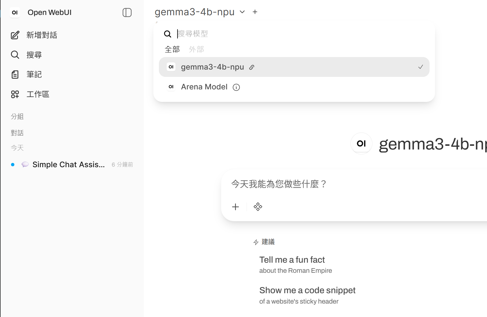

# AMD Ryzen AI 模型部署之路

## 📋 摘要

本專案專門為 AMD Ryzen AI 系列處理器提供 **推論加速引擎**，支援 HuggingFace 及 [AMD Collections](https://huggingface.co/amd) 開源的語言模型。若非使用本專案指定的軟體堆疊版本，部分功能與模型相容性可能會失效。

## 📰 Ryzen AI 最新進展

### NPU (XDNA)

- 2025年3月發布首款能在原生 NPU 上推理 Google Gemma-3，展示 NPU 與影像、語音等模態的相容性。[[1]](https://www.amd.com/en/developer/resources/technical-articles/introducing-amd-support-for-new-gemma-3-models-from-google.html?utm_source=copilot.com)
- 與微軟Copilot+PC合作，於ONNX Runtime 1.24.0 起新增 Vitis AI EP 以支援 GPU/NPU Hybrid Delegate。[[2]](https://onnxruntime.ai/docs/execution-providers/Vitis-AI-ExecutionProvider.html)
- 採用 MXFP4 低位元量化技術，於HuggingFace開源 NPU Offload 模型。
    - [Ryzen AI 1.7 NPU LLM Collection V1](https://huggingface.co/collections/ryzen-ai-17-npu-llm)
    - [Ryzen AI 1.7 NPU LLM Collection V2](https://huggingface.co/collections/ryzen-ai-17-npu-llm-v2)

### iGPU (RDNA)

- 部分Ryzen™ APUs 型號開始支援Windows及Linux使用ROCm7.2.1+PyTorch 2.9.1。[[3]](https://www.amd.com/zh-tw/newsroom/press-releases/2026-1-5-amd-expands-ai-leadership-across-client-graphics-.html)
    - [Use ROCm on Radeon and Ryzen](https://rocm.docs.amd.com/projects/radeon-ryzen/en/latest/index.html) 
    - [Windows support matrices by ROCm version](https://rocm.docs.amd.com/projects/radeon-ryzen/en/latest/docs/compatibility/compatibilityryz/windows/windows_compatibility.html)


## 📥 安裝指南

### 安裝 AMD Ryzen AI Software 1.7.1

**Step 1. 安裝 NPU 驅動軟體並建立 Ryzen AI 1.7.1 虛擬環境**

依照 [installation instructions](https://ryzenai.docs.amd.com/en/latest/inst.html) 下載並安裝 **NPU driver 32.0.203.280** + **ryzen-ai-lt 1.7.1**，安裝程式會自動建立 Conda 虛擬環境 `ryzen-ai-1.7.1`。完成後啟動環境並安裝本專案所需的套件：

```bash
conda activate ryzen-ai-1.7.1
pip install -r requirements.txt
```

**Step 2. 將新版的 Vitis AI EP 加入系統 PATH**

將 `C:\Program Files\RyzenAI\1.7.1\deployment` 加入環境變數，以確保執行時能載入正確版本的 Vitis AI EP。


### 安裝 AMD Software: Adrenalin Edition 26.2.2

> 限 AI Max 300、AI 465 及 AI 365 系列以上型號

**Step 1. 安裝 GPU 驅動軟體**

依照 [Release Note](https://www.amd.com/en/resources/support-articles/release-notes/RN-RAD-WIN-26-2-2.html) 下載並安裝 **whql-amd-software-adrenalin-edition-26.2.2-win11-c**。

**Step 2. 建立 ROCm PyTorch 虛擬環境**

建立 Python 3.12 執行環境，並依照 [PyTorch via PIP installation](https://rocm.docs.amd.com/projects/radeon-ryzen/en/latest/docs/install/installryz/windows/install-pytorch.html) 安裝 ROCm，再安裝本專案所需的套件：

```bash
conda create -n rocm-pytorch python=3.12
# pip install --no-cache-dir <rocm-dependencies>
# pip install --no-cache-dir <pytorch-dependencies>
```
```bash
conda activate rocm-pytorch
pip install -r requirements-rocm.txt
```

---

## 📦 支援的模型列表

本專案支援 HuggingFace 上開源的 PyTorch 模型，以及 AMD 官方針對 Ryzen AI 1.7.1 發布的 NPU 最佳化 ONNX 模型。

* [HuggingFace Models](https://huggingface.co/models)
* [AMD NPU 模型 Collections（Ryzen AI 1.7.1）](https://huggingface.co/collections/amd)

> PyTorch 模型的權重由 `transformers` 於首次執行時自動管理；NPU 最佳化模型則需依各模型頁面指示手動下載，並置於專案根目錄的 `weights/` 資料夾。

### 經實測 適用於PN54 (Ryzen AI 350)的模型

| HuggingFace Repository | Model ID | Size | Type | Backend |
|------------------------|----------|------|------|---------| 
| [`amd/Gemma-3-4b-it-mm-onnx-ryzenai-npu`](https://huggingface.co/amd/Gemma-3-4b-it-mm-onnx-ryzenai-npu) | `gemma3-4b-npu` | 6.2 GB | Vision LM | NPU |

### 經實測 適用於Vivobook S 15/16 (Ryzen AI 9 HX 370)的模型

| HuggingFace Repository | Model ID | Size | Type | Backend |
|------------------------|----------|------|------|---------|
| [`amd/Gemma-3-4b-it-mm-onnx-ryzenai-npu`](https://huggingface.co/amd/Gemma-3-4b-it-mm-onnx-ryzenai-npu) | `gemma3-4b-npu` | 6.2 GB | Vision LM | NPU |
| [`google/gemma-4-E2B-it`](https://huggingface.co/google/gemma-4-E2B-it) | `gemma4-2b-gpu` | 6.2 GB | Vision LM | iGPU |
| [`google/gemma-4-E4B-it`](https://huggingface.co/google/gemma-4-E4B-it) | `gemma4-4b-gpu` | 6.2 GB | Vision LM | iGPU |

> ROCm在 iGPU 上執行某些 LLM 工作負載（例如 Llama 1B/3B）時，可能會出現效能低於預期的情況。

### 快速開始


#### Step 1. 根據模型的 Backend 啟動對應環境（擇一）

依上方表格 **Backend** 欄位選擇環境：Model ID 結尾為 `-npu` 選 `ryzen-ai-1.7.1`，結尾為 `-gpu` 選 `rocm-pytorch`。

```powershell
conda activate rocm-pytorch      # iGPU backend（ROCm）
```
```powershell
conda activate ryzen-ai-1.7.1    # NPU backend（VitisAI EP）
```

#### Step 2. 執行推論

```powershell
# 單次推論（加 --stream 啟用逐 token 輸出）
python cli.py --model <model-id> --prompt "解釋量子計算" --stream

# 含圖片（Vision LM）
python cli.py --model <model-id> --image cat.jpg --prompt "描述這張圖片" --stream

# 互動模式
python cli.py --model <model-id>
```

---

### 進階用法：整合應用開發

#### 一、啟動 API Server

`api.py` 提供相容 OpenAI 協議的本地 HTTP server，啟動後所有下方工具均可透過 `http://localhost:8000` 串接，無需修改任何程式碼。

```powershell

conda activate <environment>
python api.py --model <model-id>
```
> 「Open AI Python SDK」與「Open WebUI」皆須通過額外獨立的Terminal預先啟動本API Server，才能認到模型以提供推論服務。

#### 二、使用 OpenAI SDK 進行文字對話

建立 client 時只需將 `base_url` 指向本地 server，其餘用法與官方 OpenAI SDK 完全相同。

```python
from openai import OpenAI
client = OpenAI(base_url="http://localhost:8000/v1", api_key="local")

for chunk in client.chat.completions.create(
    model="<model-id>",
    messages=[{"role": "user", "content": "解釋量子計算"}],
    stream=True,
):
    print(chunk.choices[0].delta.content or "", end="", flush=True)
```

#### 三、使用 OpenAI SDK 進行圖文對話（Vision LM）

在 `content` 中混入 `image_url` 類型的項目即可傳入圖片，僅適用於表格中 Type 欄為 `Vision LM` 的模型。

```python
import base64
image_b64 = base64.b64encode(open("cat.jpg", "rb").read()).decode()

for chunk in client.chat.completions.create(
    model="<model-id>",
    messages=[{"role": "user", "content": [
        {"type": "image_url", "image_url": {"url": f"data:image/jpeg;base64,{image_b64}"}},
        {"type": "text", "text": "描述這張圖片"},
    ]}],
    stream=True,
):
    print(chunk.choices[0].delta.content or "", end="", flush=True)
```

#### 四、整合 Open WebUI

以 Docker 啟動 [Open WebUI](https://github.com/open-webui/open-webui)，提供 ChatGPT 聊天介面、支援圖片上傳功能。

```powershell
# 第一次執行（建立容器）
docker run --name open-webui -p 3000:8080 `
  -e OPENAI_API_BASE_URL=http://host.docker.internal:8000/v1 `
  -e OPENAI_API_KEY=local `
  ghcr.io/open-webui/open-webui:main
```

當 terminal 出現 `INFO: Started server process [1]` 後，開啟 `http://localhost:3000` 即可進入 Open WebUI 頁面。

```powershell
# 之後每次重啟（或透過 Docker Desktop 按鍵重啟）
docker start -a open-webui
```

>  Open WebUI 會從 **API** 動態拉取模型清單。若選單中看不到任何模型，代表 `api.py` 尚未啟動或連線配置有誤，請確認 `python api.py --model <model-id>` 已正常運行後再重新整理頁面。
>
> 


