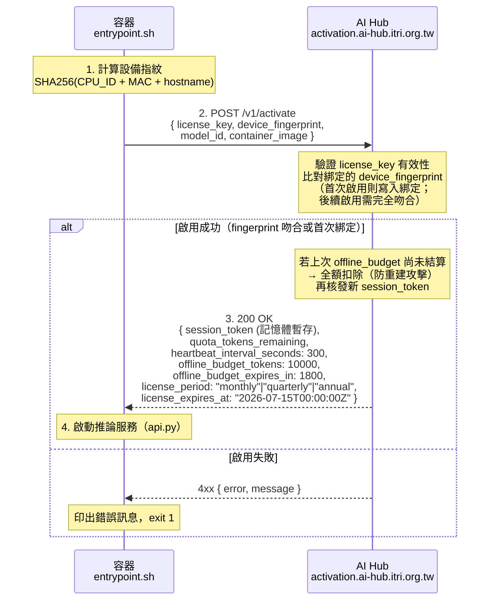
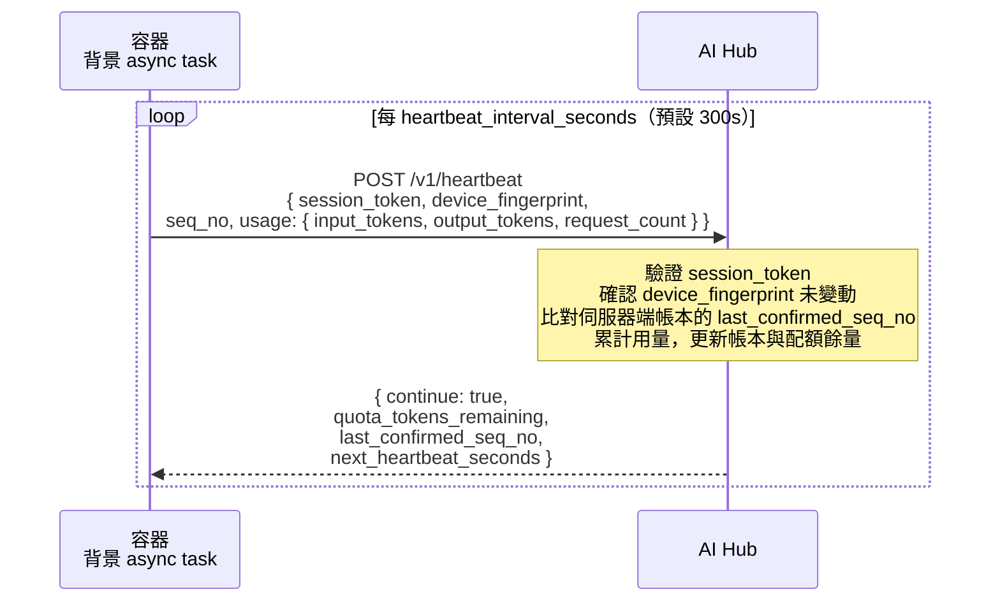
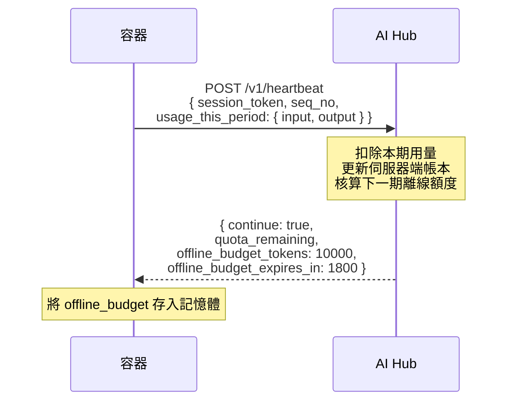
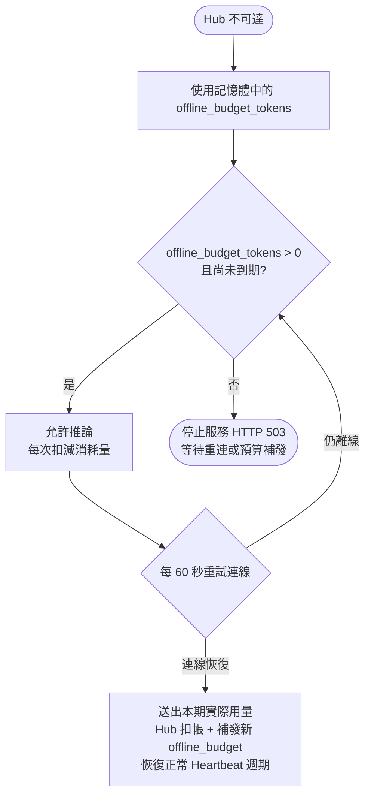
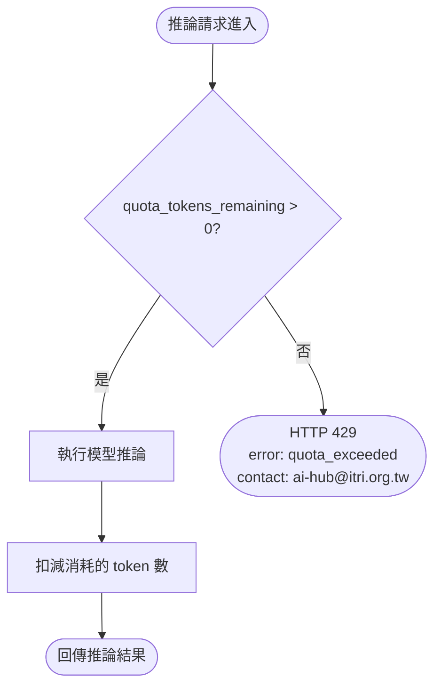
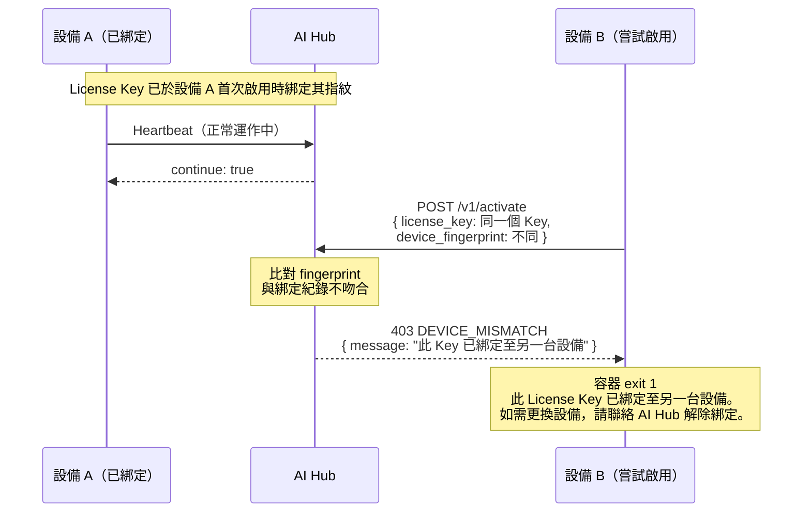

# ITRI AI Hub — 容器授權交握協定

本文件說明 ITRI AI Hub 與 Docker Model Image 之間的三段式交握機制（Three-Phase Handshake）。  
此機制在保持 **`docker pull` + `docker run` 簡單 UX** 的前提下，將 License Key 綁定至唯一設備指紋，任何指紋不符的執行請求均被拒絕。

完成首次啟用約需 **30 秒**（自動在背景執行，不影響推論服務啟動）。

---

## 使用者體驗（User-Facing UX）

Licensee 只需做兩件事：

```bash
# 步驟一：設定 License Key（一次性，建議寫入 ~/.bashrc 或 ~/.zshrc）
export AIHUB_LICENSE_KEY=lic-xxxxxxxxxxxxxxxx

# 步驟二：拉取並執行
docker pull model-cards-registry.azurecr.io/ryzenai/gemma4-4b-gpu:latest
docker run --rm -p 8000:8000 \
  -e AIHUB_LICENSE_KEY \
  -v aihub-telemetry:/app/logs \
  model-cards-registry.azurecr.io/ryzenai/gemma4-4b-gpu:latest
```

> **`-v aihub-telemetry:/app/logs` 是必要參數。**  
> `aihub-telemetry` 是 Docker Named Volume，由 Docker daemon 管理，`--rm` 不會刪除它。  
> 此 volume 用於在網路中斷期間暫存用量紀錄，容器重啟後自動補送。

啟動後，服務即可接受 OpenAI 相容 API 請求：

```bash
curl http://localhost:8000/v1/chat/completions \
  -H "Content-Type: application/json" \
  -d '{"model":"gemma4-4b-gpu","messages":[{"role":"user","content":"你好"}]}'
```

所有授權驗證、設備綁定、用量回報均在容器內部自動處理，**使用者不需要了解交握細節**。

---

## 設計目標

| 目標 | 機制 |
|------|------|
| 簡單 UX | 一個環境變數 `AIHUB_LICENSE_KEY` + 一個 Named Volume |
| 一 Key 一設備 | License Key 於首次啟用時綁定設備指紋（CPU_ID + MAC + hostname），指紋不符一律拒絕 |
| 離線容錯 | 預授權離線額度（Offline Budget）限制離線期間最大用量，到期自動停服 |
| 防重建攻擊 | 重新 Activation 時 Hub 全額扣除上一份 offline_budget，重建越多扣越多 |
| 雙邊帳本 | 使用者消耗 Budget（−tokens）；模型擁有者獲得 Credit（+tokens）；兩條獨立排行 |
| 授權週期 | License Key 以年／季／月為週期發行，到期前可申請續約 |

---

## 雙邊帳本機制（Dual-Ledger）

每一筆推論請求在 Hub 端同時更新兩個帳本：

```
一次推論請求（消耗 N tokens）
    │
    ├─ 使用者帳本（Deployer Budget）
    │       └─ quota_tokens_remaining −N
    │            → 活躍度排行（誰用最多）
    │
    └─ 模型擁有者帳本（Model Owner Credit）
            └─ credit_tokens_earned +N
                 → 貢獻度排行（誰的模型最受歡迎）
```

| 角色 | 帳本 | 排行指標 |
|------|------|---------|
| **部署者（Deployer）** | Budget：授權週期內可消耗的 token 總量 | 活躍度排行（消耗越多排越高） |
| **模型擁有者（Model Owner）** | Credit：旗下模型被消耗的累計 token 數 | 貢獻度排行（被用越多排越高） |

> **Model Card 中的 `model_owner_account` 欄位**決定 Credit 歸屬。每張模型卡上線時即鎖定此欄位，不可事後修改。

---

## 三段式交握流程

### Phase 0 — 環境準備（使用者側，一次性）

```
使用者設定環境變數
    └── export AIHUB_LICENSE_KEY=lic-xxxxxxxxxxxxxxxx
         └── docker run -e AIHUB_LICENSE_KEY ...
              └── 容器從環境變數讀取 Key，進入 Phase 1
```

---

### Phase 1 — 啟動啟用（Activation Handshake）

> **觸發時機**：容器每次啟動時執行一次



**啟用失敗的情況：**

| 錯誤碼 | 原因 | 容器行為 |
|--------|------|---------|
| `LICENSE_INVALID` | Key 不存在或已撤銷 | 印出錯誤訊息，exit 1 |
| `LICENSE_EXPIRED` | Key 已過期 | 印出到期日，exit 1 |
| `DEVICE_MISMATCH` | 設備指紋與綁定紀錄不符（Key 已綁定至另一台設備） | 印出錯誤訊息，提示聯絡 AI Hub 解綁，exit 1 |
| `MODEL_NOT_PERMITTED` | 此 Key 不允許執行此模型 | 列出許可的模型清單，exit 1 |

---

### Phase 2 — 定期心跳（Heartbeat）

> **觸發時機**：推論服務啟動後，每 `heartbeat_interval_seconds`（預設 5 分鐘）執行一次



**心跳中斷的處理（預授權離線額度機制）：**

> **設計原則**：Hub 是唯一帳本。離線期間，容器只能消耗「已預先授權的離線額度」，不依賴本地記錄的用量準確性。

每次心跳回應中，Hub 同時下發下一個心跳週期的**預授權離線額度（Offline Budget）**：





**為什麼這樣設計是安全的：**

| 攻擊情境 | 系統回應 |
|---------|---------|
| 使用者刪除 Named Volume | offline_budget 在記憶體中，不受影響；Hub 帳本不變 |
| 使用者修改 Volume 中的暫存紀錄 | Hub 全額扣除 offline_budget，不採信客戶端回報數字 |
| 使用者讓容器永遠離線不重連 | offline_budget 有到期時間（`offline_budget_expires_in`），到期後停服 |
| 使用者不斷 `docker run --rm` 重建 | 每次重新 Activation，Hub 全額扣除上一份 budget → **重建越多扣越多，無法獲利** |
| 使用者竄改 Volume 少報用量 | Hub 不採信客戶端數字，統一以「offline_budget 全數消耗完」計帳 |

**Named Volume 在此設計中的角色縮減為：**
- 暫存「本期已消耗用量」，在重連後誠實回報給 Hub
- 即使全部刪除，Hub 只會以「offline_budget 全數消耗完」來計帳（最保守估算）
- 使用者無法靠刪除 Volume 來獲利

---

### Phase 3 — 逐請求配額防護（Per-Request Guard）

> **觸發時機**：每次推論請求進入 `api.py` 時，在模型推論前檢查



---

## 設備指紋（Device Fingerprint）計算方式

設備指紋由容器內部計算，不需要使用者操作：

```python
import hashlib, platform, uuid

def compute_device_fingerprint() -> str:
    """
    組合多個硬體識別碼，對 MAC 位址異動（如 VPN、容器網路重建）有一定容忍度。
    最終結果為 SHA256 hex digest（64 字元）。
    """
    components = []

    # CPU 序號（Linux: /proc/cpuinfo，Windows: wmic）
    try:
        with open("/proc/cpuinfo") as f:
            for line in f:
                if "Serial" in line or "Hardware" in line:
                    components.append(line.strip())
    except Exception:
        pass

    # 主機名稱（穩定識別符）
    components.append(platform.node())

    # 第一個非 loopback MAC（轉換為字串避免每次啟動漂移）
    mac = uuid.getnode()
    if mac != uuid.getnode():  # 若每次不同（虛擬 MAC）則略過
        pass
    else:
        components.append(str(mac))

    raw = "|".join(components)
    return "sha256:" + hashlib.sha256(raw.encode()).hexdigest()
```

> **隱私說明**：設備指紋僅儲存其雜湊值，不包含可識別個人身份的資訊。AI Hub 收到的是不可逆的 SHA256 摘要。

---

## 防複製機制說明

下圖說明當使用者嘗試將同一個 License Key 複製到未授權設備時，系統如何回應：



**若使用者需要合法更換設備：**

1. 聯絡 AI Hub（ai-hub@itri.org.tw）申請解除原設備綁定
2. 平台確認後清除該 License Key 的 fingerprint 紀錄
3. 在新設備重新執行 `docker run`，首次啟用自動完成新設備綁定

---

## AI Hub 平台側 API 規格（Platform Reference）

以下為 AI Hub 需實作的端點規格，供平台開發團隊參考。

### `POST /v1/activate`

**Request:**
```json
{
  "license_key": "lic-xxxxxxxxxxxxxxxx",
  "device_fingerprint": "sha256:abcdef...",
  "model_id": "gemma4-4b-gpu",
  "container_image": "model-cards-registry.azurecr.io/ryzenai/gemma4-4b-gpu@sha256:def456"
}
```

**Response 200:**
```json
{
  "session_token": "st-yyyyyyyyyy",
  "quota_tokens_remaining": 500000,
  "heartbeat_interval_seconds": 300,
  "grace_period_seconds": 1800,
  "expires_at": "2026-07-15T00:00:00Z"
}
```

**Response 4xx:**
```json
{
  "error": "DEVICE_MISMATCH",
  "message": "此 License Key 已綁定至另一台設備。如需更換設備，請聯絡 AI Hub 解除綁定。"
}
```

---

### `POST /v1/heartbeat`

**Request:**
```json
{
  "session_token": "st-yyyyyyyyyy",
  "device_fingerprint": "sha256:abcdef...",
  "usage_since_last_heartbeat": {
    "input_tokens": 1240,
    "output_tokens": 3871,
    "request_count": 12
  }
}
```

**Response 200:**
```json
{
  "continue": true,
  "quota_tokens_remaining": 495000,
  "next_heartbeat_seconds": 300
}
```

**Response 401（session 被撤銷時）:**
```json
{
  "continue": false,
  "error": "SESSION_REVOKED",
  "message": "License Key 已被撤銷或設備授權已解除，請重新啟用或聯絡 AI Hub。"
}
```

---

## 附錄：容器側實作責任分工

| 元件 | 負責的交握行為 |
|------|--------------|
| `entrypoint.sh` | Phase 1 啟動啟用、啟用失敗時 exit 1 |
| `api.py`（背景 task） | Phase 2 定期 Heartbeat、離線暫存 |
| `api.py`（請求攔截）| Phase 3 逐請求配額防護（429 回應） |
| `ryzenai/modules/` | **不涉及任何交握邏輯**（由框架層統一處理） |
