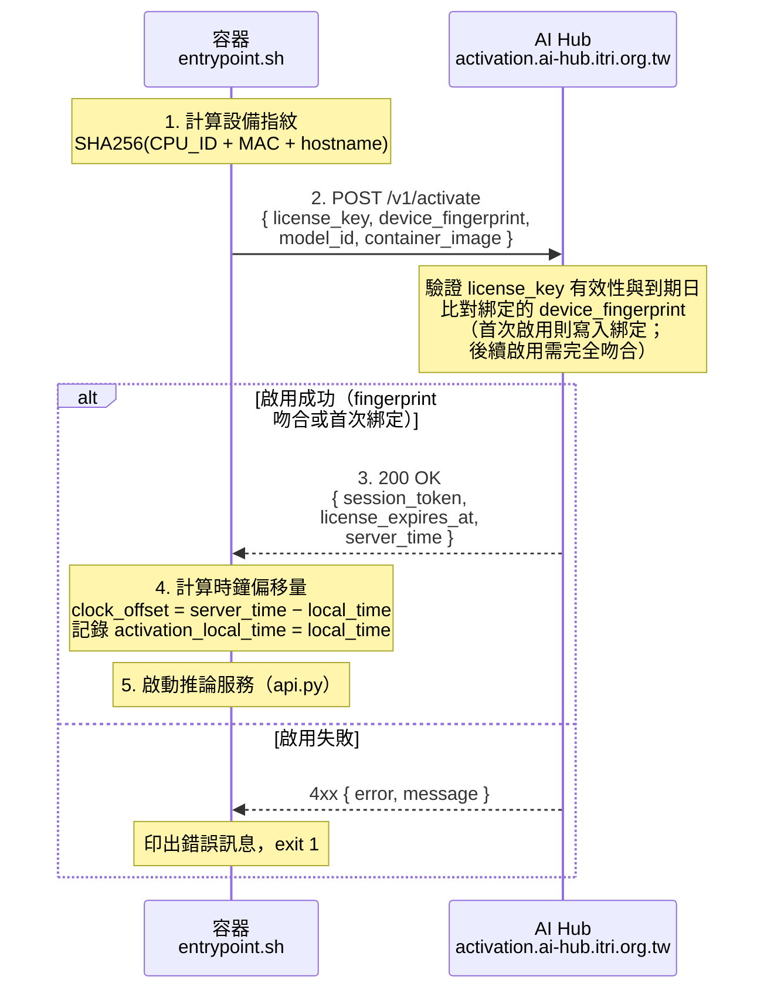
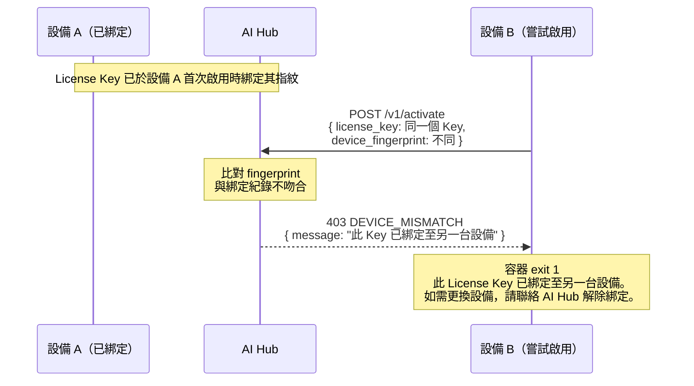

# ITRI AI Hub — 容器授權交握協定

本文件說明 ITRI AI Hub 與 Docker Model Image 之間的交握機制（Single-Phase Activation）。  
此機制在保持 **`docker run` 簡單 UX** 的前提下，將 License Key 綁定至唯一設備指紋，任何指紋不符的執行請求均被拒絕。

完成首次啟用約需 **30 秒**（自動在背景執行，不影響推論服務啟動）。

---

## 使用者體驗（User-Facing UX）

**步驟一：從 AI Hub Portal 取得授權金鑰**

1. 登入 [ITRI AI Hub Portal](https://ai-hub.itri.org.tw)
2. 前往 **Model Cards**，瀏覽可用模型
3. 選取目標模型卡，點擊 **部署**
4. 選取授權類型（月租／季租／年租）
5. 系統自動將此模型記錄至 **我的模型資產**，並產生專屬授權金鑰
6. 複製金鑰

**步驟二：執行模型**

```bash
docker run --rm -p 8000:8000 \
  -e AIHUB_LICENSE_KEY=<你的授權金鑰> \
  model-cards.azurecr.io/amd/rocm/gemma4-4b:latest
```

> 首次執行時 Docker 會自動拉取 Image，無需另行 `docker pull`。

啟動後，服務即可接受 OpenAI 相容 API 請求：

```bash
curl http://localhost:8000/v1/chat/completions \
  -H "Content-Type: application/json" \
  -d '{"model":"gemma4-4b","messages":[{"role":"user","content":"你好"}]}'
```

所有授權驗證與設備綁定均在容器內部自動處理，**使用者不需要了解交握細節**。

---

## 設計目標

| 目標 | 機制 |
|------|------|
| 簡單 UX | 單一 `docker run` 指令，Key 直接以 `-e AIHUB_LICENSE_KEY=<key>` 傳入 |
| 一 Key 一設備 | License Key 於首次啟用時綁定設備指紋（CPU_ID + MAC + hostname），指紋不符一律拒絕 |
| 離線容錯 | 容器以啟用時取得的 `license_expires_at` 為依據，到期前即使暫時離線仍可繼續服務 |
| 雙邊帳本 | 授權購買時即結算：Deployer Budget −N、Model Owner Credit +N（N = 設備月數） |
| 授權週期 | License Key 以年／季／月為週期發行，到期前可申請續約 |

---

## 雙邊帳本機制（Dual-Ledger）

計量單位為 **設備月（device-month）**，在授權購買時即一次結算，不需要執行期計量。

```
購買授權（例：2 台設備 × 1 個月）
    │
    ├─ 部署者帳本（Deployer Budget）
    │       └─ −2 device-months
    │            → 活躍度排行（誰部署越多）
    │
    └─ 模型擁有者帳本（Model Owner Credit）
            └─ +2 device-months
                 → 貢獻度排行（誰的模型最受歡迎）
```

| 授權情境 | 扣除 Budget | 增加 Credit |
|---------|------------|------------|
| 1 台設備 × 1 個月 | 1 | 1 |
| 1 台設備 × 3 個月（季租） | 3 | 3 |
| 2 台設備 × 1 個月（兩把 Key） | 2 | 2 |
| 2 台設備 × 3 個月 | 6 | 6 |

| 角色 | 帳本 | 排行指標 |
|------|------|---------|
| **部署者（Deployer）** | Budget：已購買的設備月數累計 | 活躍度排行（部署越多排越高） |
| **模型擁有者（Model Owner）** | Credit：旗下模型被部署的設備月數累計 | 貢獻度排行（被部署越多排越高） |

> **Model Card 中的 `model_owner_account` 欄位**決定 Credit 歸屬。每張模型卡上線時即鎖定此欄位，不可事後修改。

---

## 單段啟用流程

### Phase 0 — 環境準備（使用者側，一次性）

```
docker run -e AIHUB_LICENSE_KEY=<你的授權金鑰> ...
    └── 容器從環境變數讀取 Key，進入 Phase 1
```

---

### Phase 1 — 啟動啟用（Activation Handshake）

> **觸發時機**：容器每次啟動時執行一次



**啟用失敗的情況：**

| 錯誤碼 | 原因 | 容器行為 |
|--------|------|---------|
| `LICENSE_INVALID` | Key 不存在或已撤銷 | 印出錯誤訊息，exit 1 |
| `LICENSE_EXPIRED` | Key 已過期 | 印出到期日，exit 1 |
| `DEVICE_MISMATCH` | 設備指紋與綁定紀錄不符（Key 已綁定至另一台設備） | 印出錯誤訊息，提示聯絡 AI Hub 解綁，exit 1 |
| `MODEL_NOT_PERMITTED` | 此 Key 不允許執行此模型 | 列出許可的模型清單，exit 1 |

---

### 時鐘校正（Clock Correction）

> 防止使用者透過調整系統時間繞過授權到期判斷。

啟用成功後，容器在記憶體中持有三個值（不寫入磁碟）：

| 變數 | 來源 | 說明 |
|------|------|------|
| `license_expires_at` | 啟用回應 | 授權到期的 UTC 時間（伺服器權威時間） |
| `clock_offset` | 計算得出 | `server_time − local_time_at_activation` |
| `activation_local_time` | 本地記錄 | 啟用當下的本地時鐘 |

**到期判斷邏輯（每次推論前檢查）：**

```python
import time

def check_license_expiry():
    now_local = time.time()

    # 防止啟用後調慢系統時鐘
    if now_local < activation_local_time:
        raise RuntimeError("CLOCK_TAMPER: 系統時鐘已被調回，授權無效。")

    # 以伺服器時間為基準計算當前真實時間
    adjusted_now = now_local + clock_offset

    if adjusted_now >= license_expires_at:
        raise RuntimeError("LICENSE_EXPIRED: 授權已到期，請至 Portal 續約。")
```

**防護效果：**

| 攻擊手法 | 結果 |
|---------|------|
| 啟用前調慢本地時鐘 | `clock_offset` 自動補償，`adjusted_now` 仍對齊伺服器時間 |
| 啟用後調慢本地時鐘 | `now_local < activation_local_time` → `CLOCK_TAMPER` exit |
| 啟用後調快本地時鐘 | 加速到期，對使用者不利，無需處理 |

---

### Phase 2 — 定期心跳（已移除）

> MVP 不需要心跳。授權到期由 `license_expires_at` + 時鐘校正機制處理，無需持續連線 AI Hub。

---

## 設備指紋（Device Fingerprint）計算方式

設備指紋由容器內部計算，不需要使用者操作：

```python
import hashlib, platform, uuid

def compute_device_fingerprint() -> str:
    """
    組合多個硬體識別碼，對 MAC 位址異動（如 VPN、容器網路重建）有一定容忍度。
    最終結果為 SHA256 hex digest（64 字元）。
    """
    components = []

    # CPU 序號（Linux: /proc/cpuinfo，Windows: wmic）
    try:
        with open("/proc/cpuinfo") as f:
            for line in f:
                if "Serial" in line or "Hardware" in line:
                    components.append(line.strip())
    except Exception:
        pass

    # 主機名稱（穩定識別符）
    components.append(platform.node())

    # 第一個非 loopback MAC（轉換為字串避免每次啟動漂移）
    mac = uuid.getnode()
    if mac != uuid.getnode():  # 若每次不同（虛擬 MAC）則略過
        pass
    else:
        components.append(str(mac))

    raw = "|".join(components)
    return "sha256:" + hashlib.sha256(raw.encode()).hexdigest()
```

> **隱私說明**：設備指紋僅儲存其雜湊值，不包含可識別個人身份的資訊。AI Hub 收到的是不可逆的 SHA256 摘要。

---

## 防複製機制說明

下圖說明當使用者嘗試將同一個 License Key 複製到未授權設備時，系統如何回應：



**若使用者需要合法更換設備：**

1. 聯絡 AI Hub（ai-hub@itri.org.tw）申請解除原設備綁定
2. 平台確認後清除該 License Key 的 fingerprint 紀錄
3. 在新設備重新執行 `docker run`，首次啟用自動完成新設備綁定

---

## AI Hub 平台側 API 規格（Platform Reference）

以下為 AI Hub 需實作的端點規格，供平台開發團隊參考。

### `POST /v1/activate`

**Request:**
```json
{
  "license_key": "<你的授權金鑰>",
  "device_fingerprint": "sha256:abcdef...",
  "model_id": "amd/rocm/gemma4-4b",
  "container_image": "model-cards.azurecr.io/amd/rocm/gemma4-4b@sha256:def456"
}
```

**Response 200:**
```json
{
  "session_token": "st-yyyyyyyyyy",
  "license_expires_at": "2026-07-15T00:00:00Z",
  "server_time": "2026-06-15T09:24:58Z"
}
```

**Response 4xx:**
```json
{
  "error": "DEVICE_MISMATCH",
  "message": "此 License Key 已綁定至另一台設備。如需更換設備，請聯絡 AI Hub 解除綁定。"
}
```

---

## 附錄：容器側實作責任分工

| 元件 | 負責的交握行為 |
|------|--------------|
| `entrypoint.sh` | 啟動啟用（`/v1/activate`）、失敗時 exit 1、計算並儲存 `clock_offset` |
| `api.py` | 每次推論前呼叫 `check_license_expiry()`；到期或時鐘篡改時回傳 HTTP 503 |
| `ryzenai/modules/` | **不涉及任何交握邏輯**（由框架層統一處理） |
