# ITRI AI Hub ??容器?ˆæ?交æ�¡?”å?

?¬æ?件說??ITRI AI Hub ??Docker Model Image 之é??„ä?段å?交æ�¡æ©Ÿåˆ¶ï¼ˆThree-Phase Handshake）ã€? 
æ­¤æ??¶åœ¨ä¿�æ? **`docker pull` + `docker run` ç°¡å–® UX** ?„å??�ä?，å? License Key ç¶�å??³å”¯ä¸€è¨­å??‡ç?，任何æ?ç´‹ä?符ç??·è?è«‹æ??‡è¢«?’ç???

完æ?首次?Ÿç”¨ç´„é? **30 ç§?*（自?•åœ¨?Œæ™¯?·è?，ä?影響?¨è??�å??Ÿå?）ã€?

---

## 使用?…é?é©—ï?User-Facing UXï¼?

Licensee ?ªé??šå…©ä»¶ä?ï¼?

```bash
# æ­¥é?一：設å®?License Key（ä?次性ï?建議寫入 ~/.bashrc ??~/.zshrcï¼?
export AIHUB_LICENSE_KEY=lic-xxxxxxxxxxxxxxxx

# æ­¥é?二ï??‰å?並執è¡?
docker pull model-cards.azurecr.io/amd/rocm/gemma4-4b:latest
docker run --rm -p 8000:8000 \
  -e AIHUB_LICENSE_KEY \
  model-cards.azurecr.io/amd/rocm/gemma4-4b:latest
```

?Ÿå?後ï??�å??³å�¯?¥å? OpenAI ?¸å®¹ API è«‹æ?ï¼?

```bash
curl http://localhost:8000/v1/chat/completions \
  -H "Content-Type: application/json" \
  -d '{"model":"gemma4-4b-gpu","messages":[{"role":"user","content":"你好"}]}'
```

?€?‰æ?權é?è­‰ã€�設?™ç?定ã€�用?�å??±å??¨å®¹?¨å…§?¨è‡ª?•è??†ï?**使用?…ä??€è¦�ä?è§?º¤?¡ç´°ç¯€**??

---

## 設è??®æ?

| ?®æ? | 機制 |
|------|------|
| ç°¡å–® UX | 一?‹ç’°å¢ƒè???`AIHUB_LICENSE_KEY`，無?€?›è? Volume |
| 一 Key 一設å? | License Key ?¼é?次å??¨æ?ç¶�å?設å??‡ç?（CPU_ID + MAC + hostname）ï??‡ç?ä¸�符一律æ?çµ?|
| ?¢ç?容錯 | ?�æ?權離線é?度ï?Offline Budget）é??¶é›¢ç·šæ??“æ?大用?�ï??°æ??ªå??œæ? |
| ?²é?建攻??| ?�æ–° Activation ??Hub ?¨é???™¤ä¸Šä?ä»?offline_budget，é?建è?多扣越å? |
| ?™é?帳本 | 使用?…æ???Budget（â?tokens）ï?模å??�æ??…ç�²å¾?Creditï¼?tokens）ï??©æ??¨ç??’è? |
| ?ˆæ??±æ? | License Key 以年ï¼�å­£ï¼�æ??ºé€±æ??¼è?，到?Ÿå??¯ç”³è«‹ç?ç´?|

---

## ?™é?帳本機制（Dual-Ledgerï¼?

æ¯�ä?ç­†æ�¨è«–è?求在 Hub 端å??‚æ›´?°å…©?‹å¸³?¬ï?

```
一次æ�¨è«–è?求ï?消è€?N tokensï¼?
    ??
    ?œâ? 使用?…帳?¬ï?Deployer Budgetï¼?
    ??      ?”â? quota_tokens_remaining ?’N
    ??           ??æ´»è?度æ?è¡Œï?誰用?€å¤šï?
    ??
    ?”â? 模å??�æ??…帳?¬ï?Model Owner Creditï¼?
            ?Ӊ? credit_tokens_earned +N
                 ??è²¢ç�»åº¦æ?è¡Œï?誰ç?模å??€?—æ­¡è¿�ï?
```

| 角色 | 帳本 | ?’è??‡æ? |
|------|------|---------|
| **?¨ç½²?…ï?Deployerï¼?* | Budget：æ?權週æ??§å�¯æ¶ˆè€—ç? token 總é? | æ´»è?度æ?è¡Œï?消耗è?多æ?越é?ï¼?|
| **模å??�æ??…ï?Model Ownerï¼?* | Credit：æ?下模?‹è¢«æ¶ˆè€—ç?ç´¯è? token ??| è²¢ç�»åº¦æ?è¡Œï?被用越å??’è?高ï? |

> **Model Card 中ç? `model_owner_account` 欄ä?**決å? Credit 歸屬?‚æ?張模?‹å�¡ä¸Šç??‚å�³?–å?æ­¤æ?ä½�ï?ä¸�å�¯äº‹å?修改??

---

## 三段å¼�交?¡æ?ç¨?

### Phase 0 ???°å?準å?（使?¨è€…å�´ï¼Œä?次性ï?

```
使用?…設定環境è???
    ?”â??€ export AIHUB_LICENSE_KEY=lic-xxxxxxxxxxxxxxxx
         ?”â??€ docker run -e AIHUB_LICENSE_KEY ...
              ?”â??€ 容器å¾�環境è??¸è???Key，進入 Phase 1
```

---

### Phase 1 ???Ÿå??Ÿç”¨ï¼ˆActivation Handshakeï¼?

> **觸發?‚æ?**：容?¨æ?次å??•æ??·è?一æ¬?



**?Ÿç”¨å¤±æ??„æ?æ³�ï?**

| ?¯èª¤ç¢?| ?Ÿå? | 容器行為 |
|--------|------|---------|
| `LICENSE_INVALID` | Key ä¸�å??¨æ?已撤??| ?°å‡º?¯èª¤è¨Šæ�¯ï¼Œexit 1 |
| `LICENSE_EXPIRED` | Key å·²é???| ?°å‡º?°æ??¥ï?exit 1 |
| `DEVICE_MISMATCH` | 設å??‡ç??‡ç?定ç??„ä?符ï?Key å·²ç?定至?¦ä??°è¨­?™ï? | ?°å‡º?¯èª¤è¨Šæ�¯ï¼Œæ?示è�¯çµ?AI Hub è§??，exit 1 |
| `MODEL_NOT_PERMITTED` | æ­?Key ä¸�å?許執行此模å? | ?—出許å�¯?„模?‹æ??®ï?exit 1 |

---

### Phase 2 ??定æ?心跳（Heartbeatï¼?

> **觸發?‚æ?**：æ�¨è«–æ??™å??•å?，æ? `heartbeat_interval_seconds`（é?è¨?5 ?†é?）執行ä?æ¬?



**心跳中斷?„è??†ï??�æ?權離線é?度æ??¶ï?ï¼?*

> **設è??Ÿå?**：Hub ?¯å”¯ä¸€å¸³æœ¬?‚離線æ??“ï?容器?ªèƒ½æ¶ˆè€—「已?�å??ˆæ??„離線é?度ã€�ï?ä¸�ä?賴本?°è??„ç??¨é?準確?§ã€?

æ¯�次心跳?�æ?中ï?Hub ?Œæ?下發下ä??‹å?跳週æ???*?�æ?權離線é?度ï?Offline Budgetï¼?*ï¼?





**?ºä?麼這樣設è??¯å??¨ç?ï¼?*

| ?»æ??…å? | 系統?�æ? |
|---------|---------|
| 使用?…刪??Named Volume | offline_budget ?¨è??¶é?中ï?ä¸�å?影響；Hub 帳本ä¸�è? |
| 使用?…ä¿®??Volume 中ç??«å?ç´€??| Hub ?¨é???™¤ offline_budget，ä??¡ä¿¡å®¢æˆ¶ç«¯å??±æ•¸å­?|
| 使用?…è?容器永é??¢ç?ä¸�é???| offline_budget ?‰åˆ°?Ÿæ??“ï?`offline_budget_expires_in`）ï??°æ?後å???|
| 使用?…ä???`docker run --rm` ?�建 | æ¯�次?�æ–° Activation，Hub ?¨é???™¤ä¸Šä?ä»?budget ??**?�建越å????多ï??¡æ??²åˆ©** |
| 使用?…ç???Volume å°‘å ±?¨é? | Hub ä¸�æ�¡ä¿¡å®¢?¶ç«¯?¸å?，統一以「offline_budget ?¨æ•¸æ¶ˆè€—å??�è?å¸?|

**Named Volume ?¨æ­¤è¨­è?中已ä¸�é?è¦�ã€?*

?€?‰è?è²»é?輯å???Hub 伺æ??¨ç«¯å¸³æœ¬æ±ºå?，客?¶ç«¯ä¸�ä?存任何æ??ˆç?計費?€?‹ï?
- offline_budget 存於容器記憶體ï?容器?œæ­¢?³æ?æ»?
- Hub ?¨ä?æ¬?Activation ?‚å…¨é¡�扣?¤ä?一ä»?budget，ä??€è¦�客?¶ç«¯ä»»ä??�ä??–è???

---

### Phase 3 ???�è?求é?é¡�防護ï?Per-Request Guardï¼?

> **觸發?‚æ?**：æ?次æ�¨è«–è?求進入 `api.py` ?‚ï??¨æ¨¡?‹æ�¨è«–å?檢查

```mermaid
flowchart TD
    A([?¨è?è«‹æ??²å…¥]) --> B{quota_tokens_remaining > 0?}
    B -- ??--> C[?·è?模å??¨è?]
    C --> D[???消耗ç? token ?¸]
    D --> E([?�傳?¨è?çµ�æ?])
    B -- ??--> F([HTTP 429\nerror: quota_exceeded\ncontact: ai-hub@itri.org.tw])
```



---

## 設å??‡ç?（Device Fingerprint）è?ç®—æ–¹å¼?

設å??‡ç??±å®¹?¨å…§?¨è?ç®—ï?ä¸�é?è¦�使?¨è€…æ?作ï?

```python
import hashlib, platform, uuid

def compute_device_fingerprint() -> str:
    """
    組å?多個硬體è??¥ç¢¼ï¼Œå? MAC ä½�å??°å?（å? VPN?�容?¨ç¶²è·¯é?建ï??‰ä?定容å¿�度??
    ?€çµ‚ç??œç‚º SHA256 hex digestï¼?4 å­—å?）ã€?
    """
    components = []

    # CPU åº�è?（Linux: /proc/cpuinfo，Windows: wmicï¼?
    try:
        with open("/proc/cpuinfo") as f:
            for line in f:
                if "Serial" in line or "Hardware" in line:
                    components.append(line.strip())
    except Exception:
        pass

    # 主æ??�稱（穩定è??¥ç¬¦ï¼?
    components.append(platform.node())

    # 第ä??‹é? loopback MAC（è??›ç‚ºå­—串?¿å?æ¯�次?Ÿå?漂移ï¼?
    mac = uuid.getnode()
    if mac != uuid.getnode():  # ?¥æ?次ä??Œï??›æ“¬ MAC）å??¥é?
        pass
    else:
        components.append(str(mac))

    raw = "|".join(components)
    return "sha256:" + hashlib.sha256(raw.encode()).hexdigest()
```

> **?±ç?說æ?**：設?™æ?ç´‹å??²å??¶é?湊值ï?ä¸�å??«å�¯è­˜åˆ¥?‹äººèº«ä»½?„è?訊。AI Hub ?¶åˆ°?„是ä¸�å�¯?†ç? SHA256 ?˜è???

---

## ?²è?製æ??¶èªª??

下å?說æ??¶ä½¿?¨è€…å?試å??Œä???License Key 複製?°æœª?ˆæ?設å??‚ï?系統如ä??�æ?ï¼?



**?¥ä½¿?¨è€…é?è¦�å?法更?›è¨­?™ï?**

1. ?¯çµ¡ AI Hub（ai-hub@itri.org.tw）申請解?¤å?設å?ç¶�å?
2. å¹³å�°ç¢ºè?後æ??¤è©² License Key ??fingerprint ç´€??
3. ?¨æ–°è¨­å??�æ–°?·è? `docker run`，é?次å??¨è‡ª?•å??�新設å?ç¶�å?

---

## AI Hub 平�??API �格（Platform Reference�

以ä???AI Hub ?€å¯¦ä??„端é»�è??¼ï?供平?°é??¼å??Šå??ƒã€?

### `POST /v1/activate`

**Request:**
```json
{
  "license_key": "lic-xxxxxxxxxxxxxxxx",
  "device_fingerprint": "sha256:abcdef...",
  "model_id": "gemma4-4b-gpu",
  "container_image": "model-cards.azurecr.io/amd/rocm/gemma4-4b@sha256:def456"
}
```

**Response 200:**
```json
{
  "session_token": "st-yyyyyyyyyy",
  "quota_tokens_remaining": 500000,
  "heartbeat_interval_seconds": 300,
  "grace_period_seconds": 1800,
  "expires_at": "2026-07-15T00:00:00Z"
}
```

**Response 4xx:**
```json
{
  "error": "DEVICE_MISMATCH",
  "message": "æ­?License Key å·²ç?定至?¦ä??°è¨­?™ã€‚å??€?´æ?設å?，è??¯çµ¡ AI Hub è§?™¤ç¶�å???
}
```

---

### `POST /v1/heartbeat`

**Request:**
```json
{
  "session_token": "st-yyyyyyyyyy",
  "device_fingerprint": "sha256:abcdef...",
  "usage_since_last_heartbeat": {
    "input_tokens": 1240,
    "output_tokens": 3871,
    "request_count": 12
  }
}
```

**Response 200:**
```json
{
  "continue": true,
  "quota_tokens_remaining": 495000,
  "next_heartbeat_seconds": 300
}
```

**Response 401（session 被撤?·æ?ï¼?**
```json
{
  "continue": false,
  "error": "SESSION_REVOKED",
  "message": "License Key 已被?¤éŠ·?–設?™æ?權已è§?™¤ï¼Œè??�æ–°?Ÿç”¨?–è�¯çµ?AI Hub??
}
```

---

## ?„é?：容?¨å�´å¯¦ä?責任?†å·¥

| ?ƒä»¶ | 負責?„交?¡è???|
|------|--------------|
| `entrypoint.sh` | Phase 1 ?Ÿå??Ÿç”¨?�å??¨å¤±?—æ? exit 1 |
| `api.py`（è???taskï¼?| Phase 2 定æ? Heartbeat?�離線暫å­?|
| `api.py`（è?求æ??ªï?| Phase 3 ?�è?求é?é¡�防護ï?429 ?�æ?ï¼?|
| `ryzenai/modules/` | **ä¸�æ??Šä»»ä½•äº¤?¡é?è¼?*（由框æ�¶å±¤çµ±ä¸€?•ç?ï¼?|
